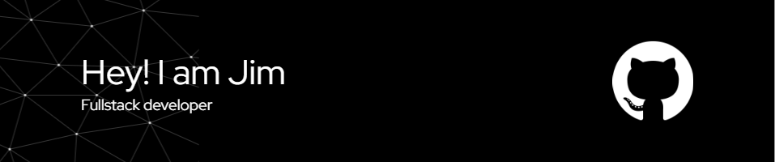

<!-- Profile Banner -->

  

<!--
**jim408401/jim408401** is a ✨ special ✨ repository because its README.md appears on your GitHub profile.
-->

<h1 align="center">Hi there 👋, I'm Jim (jim408401)</h1>

  🔭 I’m currently working on **RAG-based AI Chatbot**  

---

### 🛠 IDEs I Use

  
  
  
  
  
  
  

### 🔧 Version Control

  
  
  
  
  

---

### 💻 Languages & Frameworks I Use

#### Frontend Development

  
  
  
  
  
  
  
  
  
  

#### Machine Learning / Deep Learning

  
  
  
  
  
  
  

#### Backend Development

  
  
  
  
  
  
  

#### Database

  
  
  

#### Other Tools I Use

  
  
  

