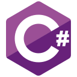
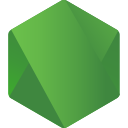
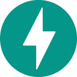
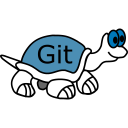

  
# About Me

> Hi, there. I'm Jim Wu 👋 I like building cool stuff with AI and web tech. 
> 🌐 [jim408401.github.io](https://jim408401.github.io)

 

### Languages

---

### Web Development

---

### Databases

---

### AI & Machine Learning

---

### DevOps & Version Control

