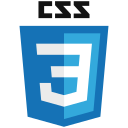
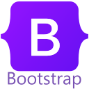
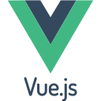
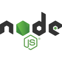
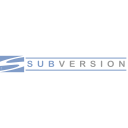

# About Me

> Hey, I'm Jim Wu 👋 I like building cool stuff with AI and web tech. Always coding, always breaking stuff, always learning new things.
>
> 🌐[jim408401.github.io](https://jim408401.github.io)

 

### Languages

  

### Frontend

  

### Backend

  

### Databases

  

### Tools

